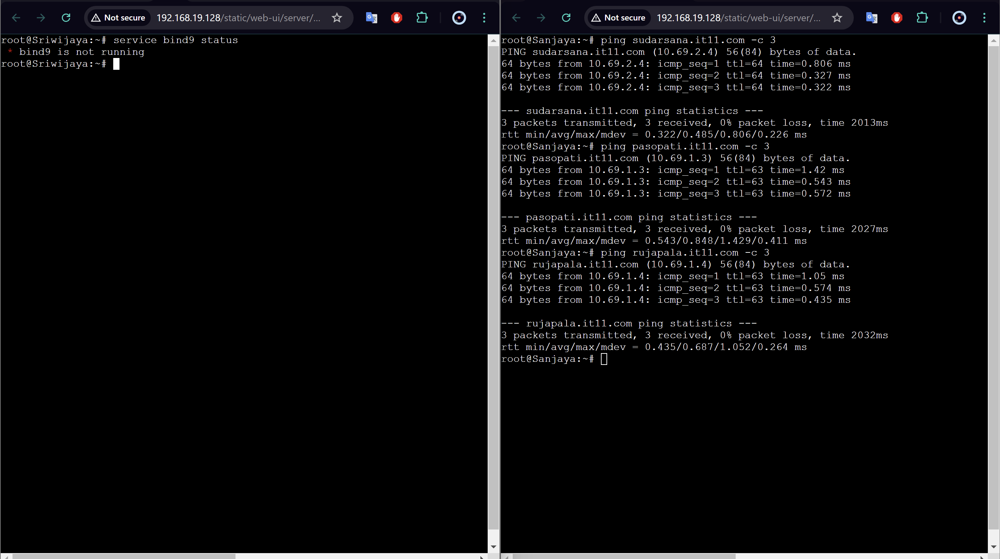

# Jarkom Modul 2

Sebuah kerajaan besar di Indonesia sedang mengalami pertempuran dengan penjajah. Kerajaan tersebut adalah **Sriwijaya**. Karena merasa terdesak **Sriwijaya** meminta bantuan pada **Majapahit** untuk mempertahankan wilayahnya. Pertempuran besar tersebut berada di **Nusantara**. Untuk topologi lihat pada [link](https://drive.google.com/drive/folders/14Pe2HOks3NzF4f_mNdrziIF56QwiKfFn) ini.

1. Untuk mempersiapkan peperangan World War MMXXIV (Iya sebanyak itu), **Sriwijaya** membuat dua kotanya menjadi web server yaitu **Tanjungkulai,** dan **Bedahulu**, serta **Sriwijaya** sendiri akan menjadi DNS Master. Kemudian karena merasa terdesak, **Majapahit** memberikan bantuan dan menjadikan kerajaannya (**Majapahit)** menjadi **DNS Slave**.


**KONFIGURASI NODE**

- **Nusantara (Router)**

```jsx
# DHCP config for eth0
auto eth0
iface eth0 inet dhcp
up iptables -t nat -A POSTROUTING -o eth0 -j MASQUERADE -s 10.69.0.0/16

# Static config for eth1
auto eth1
iface eth1 inet static
	address 10.69.1.1
	netmask 255.255.255.0

# Static config for eth2
auto eth2
iface eth2 inet static
	address 10.69.2.1
	netmask 255.255.255.0
```

- **Sanjaya (Client) (IP:** 10.69.2.2)

```jsx
# Static config for eth0
auto eth0
iface eth0 inet static
	address 10.69.2.2
	netmask 255.255.255.0
	gateway 10.69.2.1
	up echo nameserver 10.69.2.3 > /etc/resolv.conf
  up echo nameserver 10.69.1.2 >> /etc/resolv.conf
```

- **Sriwijaya (DNS Master) (IP:** 10.69.2.3)

```jsx
# Static config for eth0
auto eth0
iface eth0 inet static
	address 10.69.2.3
	netmask 255.255.255.0
	gateway 10.69.2.1
	up echo nameserver 192.168.122.1 > /etc/resolv.conf
```

- **Solok (Load Balancer) (Tujuan dari sudarsana.it11.com) (IP:** 10.69.2.4)

```jsx
# Static config for eth0
auto eth0
iface eth0 inet static
	address 10.69.2.4
	netmask 255.255.255.0
	gateway 10.69.2.1
	up echo nameserver 192.168.122.1 > /etc/resolv.conf
```

- **Samaratungga (Client) (IP:** 10.69.2.5)

```jsx
# Static config for eth0
auto eth0
iface eth0 inet static
	address 10.69.2.5
	netmask 255.255.255.0
	gateway 10.69.2.1
	up echo nameserver 10.69.2.3 > /etc/resolv.conf
  up echo nameserver 10.69.1.2 >> /etc/resolv.conf
```

- **KenArok (Client) (IP:** 10.69.2.6)

```jsx
# Static config for eth0
auto eth0
iface eth0 inet static
	address 10.69.2.6
	netmask 255.255.255.0
	gateway 10.69.2.1
  up echo nameserver 10.69.2.3 > /etc/resolv.conf
  up echo nameserver 10.69.1.2 >> /etc/resolv.conf
```

- **Majapahit (DNS Slave) (IP:** 10.69.1.2)

```jsx
# Static config for eth0
auto eth0
iface eth0 inet static
	address 10.69.1.2
	netmask 255.255.255.0
	gateway 10.69.1.1
	up echo nameserver 192.168.122.1 > /etc/resolv.conf
```

- **Kotalingga (Tujuan dari pasopati.it11.com) (IP:** 10.69.1.3)

```jsx
# Static config for eth0
auto eth0
iface eth0 inet static
	address 10.69.1.3
	netmask 255.255.255.0
	gateway 10.69.1.1
	up echo nameserver 192.168.122.1 > /etc/resolv.conf
```

- **Tanjungkulai (Tujuan dari rujapala.it11.com) (IP:** 10.69.1.4)

```jsx
# Static config for eth0
auto eth0
iface eth0 inet static
	address 10.69.1.4
	netmask 255.255.255.0
	gateway 10.69.1.1
	up echo nameserver 192.168.122.1 > /etc/resolv.conf
```

- **Bedahulu (Tujuan subdomain cakra.sudarsana.it11.com) (IP:** 10.69.1.5)

```jsx
# Static config for eth0
auto eth0
iface eth0 inet static
	address 10.69.1.5
	netmask 255.255.255.0
	gateway 10.69.1.1
	up echo nameserver 192.168.122.1 > /etc/resolv.conf
```

1. Karena para pasukan membutuhkan koordinasi untuk melancarkan serangannya, maka buatlah sebuah domain yang mengarah ke **Solok** dengan alamat **sudarsana.xxxx.com** dengan alias **www.sudarsana.xxxx.com,** dimana **xxxx** merupakan kode kelompok. Contoh: **sudarsana.it01.com**.
2. Para pasukan juga perlu mengetahui mana titik yang akan diserang, sehingga dibutuhkan domain lain yaitu **pasopati.xxxx.com** dengan alias **www.pasopati.xxxx.com** yang **mengarah ke Kotalingga**.
3. Markas pusat meminta dibuatnya domain khusus untuk menaruh informasi persenjataan dan suplai yang tersebar. Informasi dan suplai meme terbaru tersebut **mengarah ke Tanjungkulai** dan domain yang ingin digunakan adalah **rujapala.xxxx.com** dengan alias **www.rujapala.xxxx.com**.

**Untuk menyelesaikan ketiga nomor di atas jalankan script ini di Sriwijaya (DNS Master):**

sriwijayano234.sh:

```bash
#!/bin/bash

# Update package list and install BIND9
apt-get update -y
apt-get install bind9 -y

# Configure named.conf.local
cat <<EOL > /etc/bind/named.conf.local
zone "sudarsana.it11.com" {
    type master;
    file "/etc/bind/it11/sudarsana.it11.com";
};
zone "pasopati.it11.com" {
    type master;
    file "/etc/bind/it11/pasopati.it11.com";
};
zone "rujapala.it11.com" {
    type master;
    file "/etc/bind/it11/rujapala.it11.com";
};
EOL

# Create directory for zone files
mkdir /etc/bind/it11

# Copy template zone file for each domain
cp /etc/bind/db.local /etc/bind/it11/sudarsana.it11.com
cp /etc/bind/db.local /etc/bind/it11/pasopati.it11.com
cp /etc/bind/db.local /etc/bind/it11/rujapala.it11.com

# Configure sudarsana.it11.com zone file
cat <<EOL > /etc/bind/it11/sudarsana.it11.com
;
; BIND data file for local loopback interface
;
\$TTL    604800
@       IN      SOA     sudarsana.it11.com. root.sudarsana.it11.com. (
                              2         ; Serial
                         604800         ; Refresh
                          86400         ; Retry
                        2419200         ; Expire
                         604800 )       ; Negative Cache TTL
;
@       IN      NS      sudarsana.it11.com.
@       IN      A       10.69.2.4
@       IN      AAAA    ::1
www     IN      CNAME   sudarsana.it11.com.
EOL

# Configure pasopati.it11.com zone file
cat <<EOL > /etc/bind/it11/pasopati.it11.com
;
; BIND data file for local loopback interface
;
\$TTL    604800
@       IN      SOA     pasopati.it11.com. root.pasopati.it11.com. (
                              2         ; Serial
                         604800         ; Refresh
                          86400         ; Retry
                        2419200         ; Expire
                         604800 )       ; Negative Cache TTL
;
@       IN      NS      pasopati.it11.com.
@       IN      A       10.69.1.3
@       IN      AAAA    ::1
www     IN      CNAME   pasopati.it11.com.
EOL

# Configure rujapala.it11.com zone file
cat <<EOL > /etc/bind/it11/rujapala.it11.com
;
; BIND data file for local loopback interface
;
\$TTL    604800
@       IN      SOA     rujapala.it11.com. root.rujapala.it11.com. (
                              2         ; Serial
                         604800         ; Refresh
                          86400         ; Retry
                        2419200         ; Expire
                         604800 )       ; Negative Cache TTL
;
@       IN      NS      rujapala.it11.com.
@       IN      A       10.69.1.4
@       IN      AAAA    ::1
www     IN      CNAME   rujapala.it11.com.
EOL

# Restart the BIND9 service
service bind9 restart
```

1. Pastikan domain-domain tersebut dapat diakses oleh **seluruh komputer (client)** yang berada di **Nusantara**.

Di setiap konfigurasi node klien tambahkan:

```bash
up echo nameserver 10.69.2.3 > /etc/resolv.conf (ip dns master)
up echo nameserver 10.69.1.2 >> /etc/resolv.conf (ip dns slave)
```

kemudian di setiap klien coba lakukan ping ke ketiga domain:

```bash
ping sudarsana.it11.com -c 3
ping pasopati.it11.com -c 3
ping rujapala.it11.com -c 3
```


1. Beberapa daerah memiliki keterbatasan yang menyebabkan **hanya dapat** mengakses domain secara langsung melalui **alamat IP** domain tersebut. Karena daerah tersebut tidak diketahui secara spesifik, pastikan semua komputer (client) dapat mengakses domain **pasopati.xxxx.com** melalui **alamat IP Kotalingga** (Notes: menggunakan pointer record).

Jalankan script berikut di Sriwijaya (DNS Master):

sriwijaya6.sh:

```bash
#!/bin/bash

# Tambahkan konfigurasi zone di /etc/bind/named.conf.local
cat <<EOL >> /etc/bind/named.conf.local
zone "1.69.10.in-addr.arpa" {
    type master;
    file "/etc/bind/it11/1.69.10.in-addr.arpa";
};
EOL

# Buat file zona reverse lookup untuk 10.69.1.3
cp /etc/bind/db.local /etc/bind/it11/1.69.10.in-addr.arpa

# Tambahkan konfigurasi ke dalam file 1.69.10.in-addr.arpa
cat <<EOL > /etc/bind/it11/1.69.10.in-addr.arpa
;
; BIND data file for reverse lookup of 1.69.10.in-addr.arpa
;
\$TTL    604800
@       IN      SOA     pasopati.it11.com. root.pasopati.it11.com. (
                        2024050301      ; Serial
                        604800          ; Refresh
                        86400           ; Retry
                        2419200         ; Expire
                        604800 )        ; Negative Cache TTL
;
1.69.10.in-addr.arpa.   IN      NS      pasopati.it11.com.
3       IN      PTR     pasopati.it11.com.
EOL

# Restart BIND9 service untuk menerapkan konfigurasi
service bind9 restart

echo "DNS master (sriwijaya) configuration completed and service restarted."
```

Kemudian jalankan script berikut di semua client:

client06.sh:

```bash
#!/bin/bash

# Konfigurasi nameserver sementara untuk client
echo 'nameserver 192.168.122.1' > /etc/resolv.conf

# Update package list dan install dnsutils
apt-get update -y
apt-get install dnsutils -y

# Konfigurasi nameserver untuk client
echo '
nameserver 10.69.2.3
nameserver 10.69.1.2' > /etc/resolv.conf

# Melakukan pengecekan PTR record
host -t PTR 10.69.1.3
```

Kemudian jalankan ini di client untuk memeriksa keberhasilannya:

`host -t PTR 10.69.1.3`

1. Akhir-akhir ini seringkali terjadi **serangan brainrot** ke DNS Server Utama, sebagai tindakan antisipasi kamu diperintahkan untuk membuat **DNS Slave di Majapahit** untuk **semua domain** yang sudah dibuat sebelumnya yang mengarah ke **Sriwijaya**.

**SCRIPT UNTUK SRIWIJAYA**

sriwijaya7.sh

```bash
#!/bin/bash

# Menambahkan konfigurasi DNS master zones ke /etc/bind/named.conf.local
cat <<EOL > /etc/bind/named.conf.local
zone "sudarsana.it11.com" {
    type master;
    also-notify { 10.69.1.2; };
    allow-transfer { 10.69.1.2; };
    file "/etc/bind/it11/sudarsana.it11.com";
};

zone "pasopati.it11.com" {
    type master;
    also-notify { 10.69.1.2; };
    allow-transfer { 10.69.1.2; };
    file "/etc/bind/it11/pasopati.it11.com";
};

zone "rujapala.it11.com" {
    type master;
    also-notify { 10.69.1.2; };
    allow-transfer { 10.69.1.2; };
    file "/etc/bind/it11/rujapala.it11.com";
};

zone "1.69.10.in-addr.arpa" {
    type master;
    file "/etc/bind/it11/1.69.10.in-addr.arpa";
};
EOL

# Restart BIND9 service untuk menerapkan konfigurasi
service bind9 restart

echo "DNS master configuration in sriwijaya has been updated and service restarted."
```

**SCRIPT UNTUK MAJAPAHIT**

majapahit7.sh:

```bash
#!/bin/bash

# Cek apakah bind9 sudah terinstall
if ! command -v named &> /dev/null
then
    echo "Bind9 belum terinstall, melakukan instalasi..."
    # Melakukan instalasi bind9
    apt-get update
    apt-get install bind9 -y
else
    echo "Bind9 sudah terinstall."
fi

echo '
zone "sudarsana.it11.com" {
    type slave;
    masters { 10.69.2.3; }; // IP Sriwijaya
    file "/var/lib/bind/sudarsana.it11.com";
};

zone "pasopati.it11.com" {
    type slave;
    masters { 10.69.2.3; }; // IP Sriwijaya
    file "/var/lib/bind/pasopati.it11.com";
};

zone "rujapala.it11.com" {
    type slave;
    masters { 10.69.2.3; }; // IP Sriwijaya
    file "/var/lib/bind/rujapala.it11.com";
};
' > /etc/bind/named.conf.local

service bind9 restart

```

Untuk memeriksa keberhasilan, matikan bind9 di Sriwijaya (bind9 di Majapahit menyala) dan coba ping di semua client.




1. Kamu juga diperintahkan untuk membuat subdomain khusus melacak kekuatan tersembunyi **di Ohio** dengan subdomain **cakra.sudarsana.xxxx.com** yang mengarah ke Bedahulu.

Di Sriwijaya (DNS Master), Edit Setup pada file `/etc/bind/it11/sudarsana.it11.com` menjadi seperti berikut ini:

```bash
;
; BIND data file for local loopback interface
;
$TTL 604800
@       IN      SOA     sudarsana.it11.com. root.sudarsana.it11.com. (
                            2          ; Serial
                            604800     ; Refresh
                            86400      ; Retry
                            2419200    ; Expire
                            604800 )   ; Negative Cache TTL

@       IN      NS      sudarsana.it11.com.
@       IN      A       10.69.2.4
@       IN      AAAA    ::1
www     IN      CNAME   sudarsana.it11.com.
cakra   IN      A       10.69.1.5
www.cakra    IN      CNAME   cakra.sudarsana.it11.com.
```

Dan restart bind9.

```bash
service bind9 restart
```

Tes keberhasilan dengan ping subdomain cakra.sudarsana.it11.com di client.


1. Karena terjadi serangan DDOS oleh shikanoko nokonoko koshitantan (NUN), sehingga sistem komunikasinya terhalang. Untuk melindungi warga, kita diperlukan untuk membuat sistem peringatan dari siren man oleh Frekuensi Freak dan memasukkannya ke subdomain **panah.pasopati.xxxx.com** dalam folder panah dan pastikan dapat diakses secara mudah dengan menambahkan alias **www.panah.pasopati.xxxx.com** dan mendelegasikan subdomain tersebut ke **Majapahit** dengan alamat IP menuju radar di **Kotalingga**.

**DI SRIWIJAYA (DNS Master)**

Edit file /etc/bind/it11/pasopati.it11.com menjadi seperti berikut ini:

```bash
;
; BIND data file for local loopback interface
;
$TTL    604800
@       IN      SOA     pasopati.it11.com. root.pasopati.it11.com. (
                              2         ; Serial
                         604800         ; Refresh
                          86400         ; Retry
                        2419200         ; Expire
                         604800 )       ; Negative Cache TTL
;
@       IN      NS      pasopati.it11.com.
@       IN      A       10.69.1.4     ; IP Kotalingga
www     IN      CNAME   pasopati.it11.com.
ns1     IN      A       10.69.1.2     ; IP Majapahit
panah   IN      NS      ns1
@       IN      AAAA    ::1
```

Edit file /etc/bind/named.conf.options menjadi seperti berikut ini:

```bash
options {
    directory \"/var/cache/bind\";

    // If there is a firewall between you and nameservers you want
    // to talk to, you may need to fix the firewall to allow multiple
    // ports to talk.  See http://www.kb.cert.org/vuls/id/800113

    // If your ISP provided one or more IP addresses for stable
    // nameservers, you probably want to use them as forwarders.
    // Uncomment the following block, and insert the addresses replacing
    // the all-0's placeholder.

	// forwarders {
	// 	192.168.122.1; // DNS Server
	// };

    //========================================================================
    // If BIND logs error messages about the root key being expired,
    // you will need to update your keys.  See https://www.isc.org/bind-keys
    //========================================================================
    //dnssec-validation auto;
    allow-query {any;};

    auth-nxdomain no;
    listen-on-v6 { any; };
}
```

**DI MAJAPAHIT (DNS Slave)**

Edit file `/etc/bind/named.conf.options` menjadi seperti berikut:

```bash
options {
        directory "/var/cache/bind";

        allow-query{any;};

        auth-nxdomain no;    # conform to RFC1035
        listen-on-v6 { any; };
};
```

Menambahkan line berikut pada file /etc/bind/named.conf.local

```bash
zone "panah.pasopati.it11.com" {
			type master;
			allow-transfer { 10.69.2.3; };
			file "/etc/bind/panah/panah.pasopati.it11.com";
};
```

Buat direktori /etc/bind/panah .

Membuat DNS record pada /etc/bind/panah/panah.pasopati.it11.com

```bash
$TTL    604800
@       IN      SOA     panah.pasopati.it11.com. root.panah.pasopati.it11.com. (
						2				; Serial
						604800			; Refresh
						86400			; Retry
						2419200         ; Expire
						604800 )		; Negative Cache TTL
;
@       IN      NS      panah.pasopati.it11.com.
@       IN      A       10.69.1.3 ; IP Kotalingga
www     IN      CNAME   panah.pasopati.it11.com.
```

Merestart service dari bind9.

```bash
service bind9 restart
```

Tes dengan ping pasopati dengan subdomain panah di client.


1. Markas juga meminta catatan kapan saja meme brain rot akan dijatuhkan, maka buatlah subdomain baru di subdomain panah yaitu **log.panah.pasopati.xxxx.com** serta aliasnya **www.log.panah.pasopati.xxxx.com** yang juga mengarah ke **Kotalingga.**

**DI MAJAPAHIT**

Edit Setup pada file /etc/bind/panah/panah.pasopati.it11.com menjadi seperti berikut ini:

```bash
$TTL    604800
@       IN      SOA     panah.pasopati.it11.com. root.panah.pasopati.it11.com. (
                                2           ; Serial
                                604800      ; Refresh
                                86400       ; Retry
                                2419200     ; Expire
                                604800 )    ; Negative Cache TTL

; 
@       IN      NS      panah.pasopati.it11.com.
@       IN      A       10.69.1.3   ; IP Kotalingga
www     IN      CNAME   panah.pasopati.it11.com.
log     IN      A       10.69.1.3   ; IP Kotalingga
www.log IN      CNAME   log.panah.pasopati.it11.com.
```

Merestart service dari bind9.

```bash
service bind9 restart
```

Tes dengan ping subdomain log.panah.pasopati di client.


1. Setelah pertempuran mereda, warga IT dapat kembali mengakses jaringan luar dan menikmati meme brainrot terbaru, tetapi **hanya** warga **Majapahit** saja yang dapat mengakses jaringan luar secara **langsung**. Buatlah konfigurasi agar warga IT yang berada diluar Majapahit dapat mengakses jaringan luar **melalui** DNS Server **Majapahit.**

**DI MAJAPAHIT**

Edit file /etc/bind/named.conf.options menjadi seperti berikut ini:

```bash
options {
    directory \"/var/cache/bind\";

    // If there is a firewall between you and nameservers you want
    // to talk to, you may need to fix the firewall to allow multiple
    // ports to talk.  See http://www.kb.cert.org/vuls/id/800113

    // If your ISP provided one or more IP addresses for stable
    // nameservers, you probably want to use them as forwarders.
    // Uncomment the following block, and insert the addresses replacing
    // the all-0's placeholder.

	forwarders {
		192.168.122.1; // DNS Server
	};

    //========================================================================
    // If BIND logs error messages about the root key being expired,
    // you will need to update your keys.  See https://www.isc.org/bind-keys
    //========================================================================
    //dnssec-validation auto;
    allow-query {any;};

    auth-nxdomain no;
    listen-on-v6 { any; };
}
```

Merestart service dari bind9

```bash
service bind9 restart
```

Tes dengan ping [google.com](http://google.com) dari client.


1. Karena pusat ingin sebuah laman web yang ingin digunakan untuk memantau kondisi kota lainnya maka deploy laman web ini (cek resource yg lb) pada **Kotalingga** menggunakan **apache.**

Karena pusat ingin sebuah website yang ingin digunakan untuk memantau kondisi markas lainnya maka deploy lah webiste ini (cek resource yg lb) pada **severny** menggunakan **apache**

**Setup Website pada Kotalingga**

a. Instalasi dependencies yang diperlukan

```
apt-get update
apt-get install lynx apache2 php libapache2-mod-php7.0 wget unzip -y

```

b. Buat file `it11.conf` pada `/etc/apache2/sites-available/`

```
cp /etc/apache2/sites-available/000-default.conf /etc/apache2/sites-available/it11.conf

```

c. Hapus file `000-default.conf` pada `/etc/apache2/sites-enabled/`

```
rm /etc/apache2/sites-enabled/000-default.conf

```

d. Edit file `it11.conf` pada `/etc/apache2/sites-available/` menjadi seperti berikut ini

```
<VirtualHost *:8080>
ServerAdmin webmaster@localhost
DocumentRoot /var/www/html
</VirtualHost>

```

e. Tambahkan `Listen 8080` pada `/etc/apache2/ports.conf/` menjadi seperti berikut ini

```
Listen 80
Listen 8080

<IfModule ssl_module>
    Listen 443
</IfModule>

<IfModule mod_gnutls.c>
    Listen 443
</IfModule>

```

f. Nyalakan situs web yang telah di Setup pada `it02.conf`

```
a2ensite it11.conf

```

g. Unduh file `index.php`, dan letakkan pada `/var/www/html/`

```
$ mkdir -p /var/www/html/configuration/

$ wget --no-check-certificate 'https://drive.google.com/uc?export=download&id=1Sqf0TIiybYyUp5nyab4twy9svkgq8bi7' -O /var/www/html/configuration/lb.zip

$ unzip /var/www/html/configuration/lb.zip -d /var/www/html/configuration/

$ mv /var/www/html/configuration/worker/index.php /var/www/html/

$ rm -rf /var/www/html/configuration/

```

h. Nyalakan service apache

```
service apache2 start

```

**Testing**

Untuk mengecek apakah website berjalan atau tidak, dapat menggunakan command berikut:

```
lynx 10.69.1.3/index.php

```


1. Karena Sriwijaya dan Majapahit memenangkan pertempuran ini dan memiliki banyak uang dari hasil penjarahan (sebanyak 35 juta, belum dipotong pajak) maka pusat meminta kita memasang load balancer untuk membagikan uangnya pada web nya, dengan **Kotalingga, Bedahulu, Tanjungkulai** sebagai worker dan **Solok** sebagai **Load Balancer** menggunakan apache sebagai web server nya dan load balancer nya.

Setup apache2 di webserver lainnya (Bedahulu dan Tanjungkulai) dengan menjalankan script ini:

webserver13.sh:

```bash
#!/bin/bash

# Update package lists and install required packages
apt-get update
apt-get install lynx apache2 php libapache2-mod-php7.0 wget unzip -y

# Create the it11.conf file by copying from the default configuration
cp /etc/apache2/sites-available/000-default.conf /etc/apache2/sites-available/it11.conf

# Remove the default site configuration from the enabled sites
rm /etc/apache2/sites-enabled/000-default.conf

# Update the it11.conf file to listen on port 8080
cat <<EOL > /etc/apache2/sites-available/it11.conf
<VirtualHost *:8080>
    ServerAdmin webmaster@localhost
    DocumentRoot /var/www/html
</VirtualHost>
EOL

# Overwrite ports.conf to include Listen 8080
echo "Rewriting /etc/apache2/ports.conf to include Listen 8080..."
cat <<EOL > /etc/apache2/ports.conf
Listen 80
Listen 8080

<IfModule ssl_module>
    Listen 443
</IfModule>

<IfModule mod_gnutls.c>
    Listen 443
</IfModule>
EOL

# Enable the it11 site
a2ensite it11.conf

# Create configuration directory and download the required file from Google Drive
mkdir -p /var/www/html/configuration/
wget --no-check-certificate 'https://drive.google.com/uc?export=download&id=1Sqf0TIiybYyUp5nyab4twy9svkgq8bi7' -O /var/www/html/configuration/lb.zip

# Unzip the downloaded file and move index.php to the correct location
unzip /var/www/html/configuration/lb.zip -d /var/www/html/configuration/
mv /var/www/html/configuration/worker/index.php /var/www/html/

# Clean up by removing the configuration folder
rm -rf /var/www/html/configuration/

# Start Apache service
service apache2 start

# Output a message indicating completion
echo "Apache has been configured and started on port 8080"

```

**Setup load balancer pada Solok**

a. Instalasi dependencies yang diperlukan

```
apt-get update
apt-get install lynx apache2 -y

```

b. Nyalakan modul modul yang diperlukan

```
a2enmod proxy
a2enmod proxy_http
a2enmod proxy_balancer
a2enmod lbmethod_byrequests

```

c. Jalankan service apache

```
service apache2 start

```

d. Edit file `default-8080.conf` pada `/etc/apache2/sites-available/` menjadi seperti berikut ini

```
<VirtualHost *:8080>
    ServerAdmin webmaster@localhost
    DocumentRoot /var/www/it11

    ProxyRequests Off
    <Proxy balancer://mycluster>
        BalancerMember http://10.69.1.3:8080
        BalancerMember http://10.69.1.4:8080
        BalancerMember http://10.69.1.5:8080
        ProxySet lbmethod=byrequests
    </Proxy>

    ProxyPass / balancer://mycluster/
    ProxyPassReverse / balancer://mycluster/
</VirtualHost>

```

**Testing**

Untuk mengecek apakah website berjalan atau tidak, dapat menggunakan command berikut:

```bash
lynx 10.69.1.3:8080/index.php
```

```bash
lynx 10.69.1.4:8080/index.php
```

```bash
lynx 10.69.1.5:8080/index.php
```


1. Selama melakukan penjarahan mereka melihat bagaimana web server luar negeri, hal ini membuat mereka iri, dengki, sirik dan ingin flexing sehingga meminta agar web server dan load balancer nya **diubah menjadi nginx**.

**Setup Worker pada Kotalingga, Bedahulu, dan Tanjungkulai**

a. Instalasi dependencies yang diperlukan

```
apt-get update
apt-get install dnsutils lynx nginx apache2 libapache2-mod-php7.0 wget unzip php php-fpm -y

```

b. Nyalakan service php-fpm

```
service php7.0-fpm start

```

c. Nyalakan service nginx

```
service nginx start

```

d. Unduh file `index.php` dan letakkan pada `/var/www/html/`

```
$ mkdir -p /var/www/html/configuration/

$ wget --no-check-certificate 'https://drive.google.com/uc?export=download&id=1Sqf0TIiybYyUp5nyab4twy9svkgq8bi7' -O /var/www/html/configuration/lb.zip

$ unzip /var/www/html/configuration/lb.zip -d /var/www/html/configuration/

$ mv /var/www/html/configuration/worker/index.php /var/www/html/

$ rm -rf /var/www/html/configuration/

```

e. Edit file `it02` pada `/etc/nginx/sites-available/` menjadi seperti berikut ini

Untuk kotalingga:

```
server {
    listen 8082;

    root /var/www/html;

    index index.php index.html index.htm;
    server_name _;

    location / {
        try_files \$uri \$uri/ /index.php?\$query_string;
    }

    # pass PHP scripts to FastCGI server
    location ~ \.php$ {
        include snippets/fastcgi-php.conf;
        fastcgi_pass unix:/var/run/php/php7.0-fpm.sock;
    }

    location ~ /\.ht {
     deny all;
    }

    error_log /var/log/nginx/jarkom-it11_error.log;
    access_log /var/log/nginx/jarkom-it11_access.log;
}

```

Untuk tanjungkulai:

```bash
server {
    listen 8083;

    root /var/www/html;

    index index.php index.html index.htm;
    server_name _;

    location / {
        try_files \$uri \$uri/ /index.php?\$query_string;
    }

    # pass PHP scripts to FastCGI server
    location ~ \.php$ {
        include snippets/fastcgi-php.conf;
        fastcgi_pass unix:/var/run/php/php7.0-fpm.sock;
    }

    location ~ /\.ht {
     deny all;
    }

    error_log /var/log/nginx/jarkom-it11_error.log;
    access_log /var/log/nginx/jarkom-it11_access.log;
}

```

Untuk Bedahulu:

```bash
server {
    listen 8084;

    root /var/www/html;

    index index.php index.html index.htm;
    server_name _;

    location / {
        try_files \$uri \$uri/ /index.php?\$query_string;
    }

    # pass PHP scripts to FastCGI server
    location ~ \.php$ {
        include snippets/fastcgi-php.conf;
        fastcgi_pass unix:/var/run/php/php7.0-fpm.sock;
    }

    location ~ /\.ht {
     deny all;
    }

    error_log /var/log/nginx/jarkom-it11_error.log;
    access_log /var/log/nginx/jarkom-it11_access.log;
}

```

f. Buat symlink `it11` pada `/etc/nginx/sites-available/` di `/etc/nginx/sites-enabled`

```
ln -s /etc/nginx/sites-available/it11 /etc/nginx/sites-enabled

```

g. hapus `default` pada `/etc/nginx/sites-enabled/`

```
rm /etc/nginx/sites-enabled/default

```

h. Restart service nginx

```
service nginx restart

```

Atau gunakan script berikut:

webserver14.sh:

```bash
#!/bin/bash

# Update package lists and install the required dependencies
apt-get update
apt-get install dnsutils lynx nginx apache2 libapache2-mod-php7.0 wget unzip php php-fpm -y

# Start the PHP-FPM service
service php7.0-fpm start

# Start the NGINX service
service nginx start

# Create the configuration directory and download the required file from Google Drive
mkdir -p /var/www/html/configuration/
wget --no-check-certificate 'https://drive.google.com/uc?export=download&id=1Sqf0TIiybYyUp5nyab4twy9svkgq8bi7' -O /var/www/html/configuration/lb.zip

# Unzip the downloaded file and move the index.php file to the appropriate location
unzip /var/www/html/configuration/lb.zip -d /var/www/html/configuration/
mv /var/www/html/configuration/worker/index.php /var/www/html/

# Clean up by removing the configuration folder
rm -rf /var/www/html/configuration/

# Create the it11 NGINX configuration file
cat <<EOL > /etc/nginx/sites-available/it11
server {
    listen 8082; 

    root /var/www/html;

    index index.php index.html index.htm;
    server_name _;

    location / {
        try_files \$uri \$uri/ /index.php?\$query_string;
    }

    # pass PHP scripts to FastCGI server
    location ~ \.php$ {
        include snippets/fastcgi-php.conf;
        fastcgi_pass unix:/var/run/php/php7.0-fpm.sock;
    }

    location ~ /\.ht {
        deny all;
    }

    error_log /var/log/nginx/jarkom-it11_error.log;
    access_log /var/log/nginx/jarkom-it11_access.log;
}
EOL

# Create a symlink for the it11 configuration to enable it
ln -s /etc/nginx/sites-available/it11 /etc/nginx/sites-enabled/

# Remove the default NGINX site configuration
rm /etc/nginx/sites-enabled/default

# Restart the NGINX service to apply the changes
service nginx restart

# Output a message indicating completion
echo "NGINX has been configured and started on port 8082"
```

**Setup Load Balancer pada Solok**

a. Instalasi dependencies yang diperlukan

```
apt-get update
apt-get install dnsutils nginx php-fpm php -y

```

b. Nyalakan service php-fpm

```
service php7.0-fpm start

```

c. Nyalakan service nginx

```
service nginx start

```

d. Edit file `it11` pada `/etc/nginx/sites-available/` menjadi seperti berikut ini

```
upstream solok {
    server 10.69.1.3:8082; 
    server 10.69.1.4:8083; 
    server 10.69.1.5:8084;
}

server {
  listen 8082;
  server_name 10.69.2.4;

  location / {
    proxy_pass http://Solok;
  }
}

server {
  listen 8083;
  server_name 10.69.2.4;

  location / {
    proxy_pass http://Solok;
  }
}

server {
  listen 8084;
  server_name 10.69.2.4

  location / {
    proxy_pass http://Solok;
  }
}

```

e. Buat symlink `it11` pada `/etc/nginx/sites-available/` di `/etc/nginx/sites-enabled`

```
ln -s /etc/nginx/sites-available/it02 /etc/nginx/sites-enabled

```

f. Hapus `default` pada `/etc/nginx/sites-enabled/`

```
rm /etc/nginx/sites-enabled/default

```

g. Restart service nginx

```
service nginx restart

```

**Testing**

Untuk mengecek apakah website berjalan atau tidak, dapat menggunakan command berikut:

`lynx 10.69.1.3:8082/index.php`


`lynx 10.69.1.4:8083/index.php`


`lynx 10.69.1.5:8084/index.php`


1. Markas pusat meminta **laporan hasil benchmark** dengan menggunakan apache benchmark dari load balancer dengan 2 web server yang berbeda tersebut dan meminta secara detail dengan ketentuan:
- Nama Algoritma Load Balancer
- Report hasil testing apache benchmark
- Grafik request per second untuk masing masing algoritma.
- Analisis
- Meme terbaik kalian (terserah ( ͡° ͜ʖ ͡°)) 🤓

Di client jalankan:

```bash
apt-get install apache2-utils
ab -n 200 -c 10 http://10.69.2.4/
```


1. Karena dirasa kurang aman dari brainrot karena masih memakai IP, markas ingin akses ke **Solok** memakai **solok.xxxx.com** dengan alias **www.solok.xxxx.com** (sesuai web server terbaik hasil analisis kalian).

**Setup DNS pada DNS Master (Sriwijaya)**

a. Menambahkan line berikut pada file `etc/bind/named.conf.local`

```
zone "solok.it11.com" {
 		type master;
 		file "/etc/bind/it11/solok.it11.com";
 };
```

b. Membuat DNS record pada `/etc/bind/it11/solok.it11.com`

```
; BIND data file for solok domain to solok (Soal 16)
$TTL    604800
@       IN      SOA     solok.it11.com. root.solok.it11.com. (
                        2				; Serial
                        604800			; Refresh
                        86400			; Retry
                        2419200         ; Expire
                        604800 )		; Negative Cache TTL
;
@       IN      NS      solok.it11.com.
@       IN      A       10.69.2.4 ; IP Solok
www     IN      CNAME   solok.it11.com.

```

c. Merestart service dari bind9

```
service bind9 restart
```

Lakukan tes dengan ping ke [solok.it11.com](http://solok.it11.com) di client:


1. Agar aman, buatlah konfigurasi agar **solok.xxx.com hanya dapat diakses** melalui **port sebesar π x 10^4 = (phi nya desimal) dan 2000 + 2000 log 10 (10) +700 - π = ?**.

- **Port 31416**.
- **Port 4697**.

**Setup Nginx di Solok**

Edit file `it11` pada `/etc/nginx/sites-available/` menjadi seperti berikut ini

```
upstream solok {
    server 10.69.1.3:8082; 
    server 10.69.1.4:8083; 
    server 10.69.1.5:8084;
}

server {
    listen **31416**;
    server_name solok.it11.com;

    location / {
        proxy_pass http://Solok;
    }
}

server {
    listen **4697**;
    server_name solok.it11.com;

    location / {
        proxy_pass http://Solok;
    }
}

server {
    listen 8082;
    listen 8083;
    listen 8084;
    server_name 10.69.2.4;

    return 404;
}

```

**Testing**

Untuk mengecek apakah solok**.it11.com** hanya dapat diakses melalui port **31416** dan **4697**, dapat menggunakan command berikut:

`lynx solok.it11.com:31416`


`lynx solok.it11.com:4697`


1. Apa bila ada yang mencoba mengakses IP solok akan secara otomatis dialihkan ke **www.solok.xxxx.com.**

**Setup Nginx di Solok**

Edit file `it11` pada `/etc/nginx/sites-available/` menjadi seperti berikut ini:

```bash
upstream solok {
    server 10.69.1.3:8082; 
    server 10.69.1.4:8083; 
    server 10.69.1.5:8084;
}

server {
    listen 31416;
    server_name solok.it11.com;

    location / {
        proxy_pass http://solok;
    }
}

server {
    listen 4697;
    server_name solok.it11.com;

    location / {
        proxy_pass http://solok;
    }
}

server {
    listen 8082;
    listen 8083;
    listen 8084;
    server_name 10.69.2.4;

    location / {
        return 301 http://solok.it11.com:4697;
    }
}

```

Untuk testing lakukan ping 10.69.2.4 di client:


1. Karena probset sudah kehabisan ide masuk ke **salah satu** worker buatkan akses direktori listing yang mengarah ke resource worker2.

Di salah satu worker (dalam kasus ini saya memilih Kotalingga) dan buat konfigurasi sekianterimakasih.it11.com.conf di /etc/apache2/sites-available dengan konfigurasi seperti berikut:


Kemudian download dan unzip directory ke /var/www/sekianterimakasih.it11.com/worker2

```bash
wget --no-check-certificate 'https://drive.google.com/uc?export=download&id=1JGk8b-tZgzAOnDqTx5B3F9qN6AyNs7Zy' -O /var/www/sekianterimakasih.it11.com/worker2/dir-listing.zip

unzip /var/www/sekianterimakasih.it11.com/worker2/dir-listing.zip -d /var/www/sekianterimakasih.it11.com/worker2/
```

jalankan `a2ensite sekianterimakasih.it11[.com](http://jarkom2022.com/).conf` 

jalankan `service apache2 restart`

Lakukan testing dengan command `lynx 10.69.1.3/worker2` di client.


1. Worker tersebut harus dapat di akses dengan **sekiantterimakasih.xxxx.com** dengan alias **www.sekiantterimakasih.xxxx.com.**

**Konfigurasi pada Sriwijaya**

Masukkan konfigurasi zone tamat baru pada file berikut

- /etc/bind/named.conf.local

```
zone "sekianterimakasih.it11.com" {
        type master;
        file "/etc/bind/it11/sekianterimakasih.it11.com";
};

```

Buat file baru sekianterimakasih.it11.com lalu isi konfigurasi berikut

- /etc/bind/it11/sekianterimakasih.it11.com

```bash
;
; BIND data file for local loopback interface
;
$TTL    604800
@       IN      SOA     sekianterimakasih.it11.com. root.sekianterimakasih.it11.com. (
                              2         ; Serial
                         604800         ; Refresh
                          86400         ; Retry
                        2419200         ; Expire
                         604800 )       ; Negative Cache TTL
;
@             IN      NS      sekianterimakasih.it11.com.
@             IN      A       10.69.1.3
www           IN      CNAME   sekianterimakasih.it11.com.
```

Kemudian tes dengan command [`sekianterimakasih.it11.com/worker2`](http://sekianterimakasih.it11.com/worker2)  di client.


**TAMAT ANJAY**
